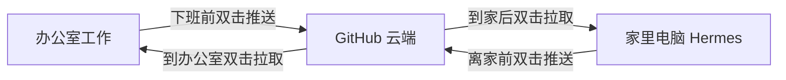

# Hermes 数据同步 - 跨电脑配置指南

## 数据流

```
办公室电脑                    GitHub 云端                    家里电脑
WSL ~/.hermes/                    |                    WSL ~/.hermes/
     ↓ 推送                        |                         ↑ 拉取
桌面 HermesAgent/ → git push → GitHub ← git pull ← 桌面 HermesAgent/
```

## 同步内容

| 同步 | 不同步 |
|------|--------|
| SOUL.md, SOUL_Pro.md, SOUL_Edu.md | .env（API Key，每台电脑独立） |
| config.yaml | sessions.db |
| memories/MEMORY.md, USER.md | state.db |
| skills/* | logs/, checkpoints/, cron/ |
| | .hermes_history, auth.json |

---

## 办公室电脑（本机）设置

### 路径
- **Windows 同步目录**: `C:\Users\Administrator\Desktop\HermesAgent\`
- **WSL 用户名**: `administrator`
- **WSL 发行版**: `Ubuntu`（Ubuntu 24.04）
- **WSL ~/.hermes/**: `/home/administrator/.hermes/`

### 桌面快捷脚本
- **推送** → 双击 `Hermes同步-推送.bat`（下班前执行）
- **拉取** → 双击 `Hermes同步-拉取.bat`（上班后执行）

---

## 家里电脑设置

### 前提条件
1. WSL2 + Ubuntu 已安装
2. Hermes Agent 已安装并运行过（有 ~/.hermes/ 目录）
3. SSH Key 已添加到 GitHub 账号 jsxuaijun-art

### 第一步：克隆仓库

打开 PowerShell：
```powershell
cd C:\Users\你的用户名\Desktop
git clone git@github.com:jsxuaijun-art/hermes-data.git HermesAgent
```

### 第二步：创建推送脚本

将以下内容保存为桌面 `Hermes同步-推送.bat`：

```batch
@echo off
chcp 65001 >nul
cls
echo.
echo ═══════════════════════════════════════
echo    Hermes 数据同步 - 推送到 GitHub
echo ═══════════════════════════════════════
echo.
echo [1/4] 从 WSL 拷贝最新数据到桌面目录...
wsl -d Ubuntu -- bash -c "
  cp -f ~/.hermes/SOUL.md /mnt/c/Users/你的用户名/Desktop/HermesAgent/
  cp -f ~/.hermes/SOUL_Pro.md /mnt/c/Users/你的用户名/Desktop/HermesAgent/
  cp -f ~/.hermes/SOUL_Edu.md /mnt/c/Users/你的用户名/Desktop/HermesAgent/
  cp -f ~/.hermes/config.yaml /mnt/c/Users/你的用户名/Desktop/HermesAgent/config.yaml
  cp -f ~/.hermes/memories/MEMORY.md /mnt/c/Users/你的用户名/Desktop/HermesAgent/memories/
  cp -f ~/.hermes/memories/USER.md /mnt/c/Users/你的用户名/Desktop/HermesAgent/memories/
  cp -rf ~/.hermes/skills/* /mnt/c/Users/你的用户名/Desktop/HermesAgent/skills/
  echo 'WSL 数据已拷贝'
"
echo.
echo [2/4] 提交变更到 Git...
cd /d C:\Users\你的用户名\Desktop\HermesAgent
git add -A
git commit -m "家里同步 %date:~0,10% %time:~0,5%"
echo.
echo [3/4] 推送到 GitHub...
wsl -d Ubuntu -- bash -c "cd /mnt/c/Users/你的用户名/Desktop/HermesAgent && git push origin main"
echo.
echo [4/4] 完成！
echo.
echo ┌─────────────────────────────────────┐
echo │  ✓ 数据已同步到 GitHub 云端         │
echo └─────────────────────────────────────┘
echo.
pause
```

### 第三步：创建拉取脚本

桌面 `Hermes同步-拉取.bat`：

```batch
@echo off
chcp 65001 >nul
cls
echo.
echo ═══════════════════════════════════════
echo    Hermes 数据同步 - 从 GitHub 拉取
echo ═══════════════════════════════════════
echo.
echo [1/3] 从 GitHub 拉取最新数据...
wsl -d Ubuntu -- bash -c "cd /mnt/c/Users/你的用户名/Desktop/HermesAgent && git pull origin main"
echo.
echo [2/3] 拷贝到 WSL Hermes 目录...
wsl -d Ubuntu -- bash -c "
  cp -f /mnt/c/Users/你的用户名/Desktop/HermesAgent/SOUL.md ~/.hermes/
  cp -f /mnt/c/Users/你的用户名/Desktop/HermesAgent/SOUL_Pro.md ~/.hermes/
  cp -f /mnt/c/Users/你的用户名/Desktop/HermesAgent/SOUL_Edu.md ~/.hermes/
  cp -f /mnt/c/Users/你的用户名/Desktop/HermesAgent/config.yaml ~/.hermes/
  mkdir -p ~/.hermes/memories
  cp -f /mnt/c/Users/你的用户名/Desktop/HermesAgent/memories/*.md ~/.hermes/memories/
  mkdir -p ~/.hermes/skills
  cp -rf /mnt/c/Users/你的用户名/Desktop/HermesAgent/skills/* ~/.hermes/skills/
  echo 'WSL 数据已更新'
"
echo.
echo [3/3] 完成！
echo.
echo ┌─────────────────────────────────────────────┐
echo │  ✓ GitHub 数据已同步到本机 Hermes           │
echo └─────────────────────────────────────────────┘
echo.
pause
```

> ⚠️ **重要**: 把上面脚本里的 `你的用户名` 替换为家里电脑的 Windows 用户名。
> 如果 WSL 发行版名字不是 `Ubuntu`，用 `wsl -l -v` 查看后也替换掉。

---

## 日常使用流程



### 注意事项
1. **切换设备前先推送**：离开前双击「推送」，确保最新数据在 GitHub
2. **切换设备后先拉取**：打开新电脑后双击「拉取」，获取最新数据
3. **不要手动改同步目录**：只通过 WSL ~/.hermes/ 修改数据，脚本会自动同步
4. **.env 不共享**：每台电脑的 API Key 各自独立配置
5. **如果冲突**：`git pull` 可能会报冲突，联系管理员处理
