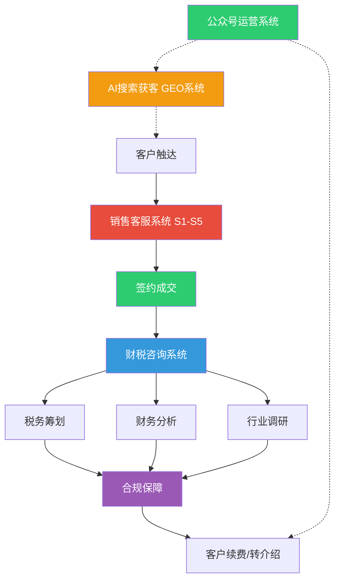

# 盈信企业管理业务系统 v3.0

> **一句话定位：** 苏州盈信企业管理有限公司16年实战经验，覆盖从「客户获取→价格谈判→签约成交→财税服务→合规保障」的全业务链路两个核心子系统。
>
> 本技能是 **销售客服系统** 和 **财税咨询系统** 的统一入口。两个子系统分别对应不同的触发条件和使用场景，但共享同一套企业知识库、客户画像和实战方法论。

---

## 系统架构

**三个子系统的关系：**

| 维度 | 销售客服系统 (S1-S5) | 财税咨询系统 | AI搜索获客系统 (GEO) | 公众号运营系统 |
|------|----------------------|-------------|---------------------|---------------|
| 角色 | 前端 — 获客、谈判、成交 | 后端 — 服务、分析、合规 | 空中 — 让客户通过AI找到你 | 内容 — 建立权威、沉淀信任、辅助GEO |
| 核心产出 | 话术、应对卡、逼单技巧 | 税务方案、财务报告、行业调研 | 投喂内容包、SEO锚点、全网覆盖 | 推文、简介/菜单/自动回复、粉丝互动 |
| 触发词 | 砍价、比价、逼单、成交、太贵了 | 财务报表、税务合规、稽查应对 | GEO/豆包/投喂/AI搜索/文心一言/DeepSeek/百度SEO | 公众号/推文/发文/盈信税务/微信文章 |
| 知识根基 | 影响力+销售巨人+销售洗脑 三书融合 | 张新民财务报表分析+刘天永税务合规实务 | AI引擎训练逻辑+全网SEO+内容矩阵 | 公众号对GEO交叉影响+内容运营实战 |
| 训练对象 | 销售/客服人员 | 会计/税务顾问 | 增长操盘手 | 内容运营 |

---

## 子系统 A — 销售客服系统（S1-S5）

> **完整内容：** `references/sales-customer-service-s1-s5.md`
>
> **全流程SOP（新客从0到1）：** `references/sales/初次洽谈SOP_完整版.md` — 3阶段流水线：电话获客(3min) → 面谈诊断(30-45min) → 跟进成交(14天闭环)，高级会计师锚点贯穿全流程。
>
> 本系统是面向财税服务行业的销售/客服实战体系。客户不是在砍价，是在找安全感 — 你的任务不是降价，是给安全感。

### S1 — 客户心理画像

**7大影响力原理**（融合自《影响力》）：互惠、承诺一致、社会认同、喜好、权威、稀缺、联盟

**四型人格识别法：**
| 类型 | 特点 | 沟通策略 |
|------|------|----------|
| 🐯 老虎型 | 果断、高效、急性子 | 直入主题，用数据说话 |
| 🦚 孔雀型 | 健谈、场面人、要面子 | 先同频再谈事，给足面子 |
| 🕊️ 鸽子型 | 性格软、犹豫、怕麻烦 | 主动做决定、推着走 |
| 🦉 猫头鹰型 | 谨慎、爱分析、抠细节 | 列数据、给证据、用案例 |

**砍价心理底层逻辑：** 客户砍价的三个真实原因 — 心理不安全感（60%）、占便宜欲望（30%）、真预算不足（10%）。核心法则：镜子效应、锚定效应、互惠原则、损失厌恶。

### S2 — 价值重塑系统

**SPIN提问法**（《销售巨人》）：S背景→P难点→I暗示（放大后果🔥）→N需求-效益（让客户自己说出价值🔥）

**FABG法则**（《销售洗脑》第5章）：Feature→Advantage→Benefit→Grabber

**价值升维框架：** 把「代账」从成本项变成投资项 — 财税健康管理 / 高级会计师带队 / 每天一杯咖啡钱

### S3 — 价格博弈战术

**王牌战术：** 拒绝-后撤策略、稀缺+竞争叠加、成本分解法、三档报价法、以退为进法、公开承诺锁定法

**砍价应对话术库（7大场景）：**
1. 客户说「太贵了」→ 认同感受→重新定义→投资视角
2. 客户说「同行比你们便宜」→ 比专业比服务，不比价格
3. 客户说「最低多少钱」→ 反问式锚定
4. 客户说「先给一个月钱试试」→ 整年签+不满意全额退款
5. 客户说「有兼职/朋友在记账」→ 法律风险+朋友赔偿尴尬
6. 客户说「要和股东商量」→ 约见面现场解答
7. 客户直接比价「XX家才XXX元」→ 三档服务对比法

**涨价沟通战术：** 原则 — 能达成共识为上，部分让步为中，无共识终止合作

### S4 — 难缠客户手册

**处理异议六步法：** 倾听→承认→请求许可→确认喜欢→问题检测→询问价格

**六类难缠客户精准打法：** 犹豫拖延型、对抗型、挑剔型、比价型、哭穷型、敌意型

### S5 — 逼单成交引擎

**10种促单技巧：** 二选一法⭐⭐⭐⭐⭐、反问促单法⭐⭐⭐⭐⭐、假定成交法⭐⭐⭐⭐⭐、主动促单法、附加促单法、第三方参考法、极限低价法…

**购买信号15条：** 触摸资料不放手、问价格细节、问付款方式、开始说「如果我签了…」——出现任意一条立即停止介绍开始成交！

**14条成交天条：** 发现战机马上致电、反问制胜、5YES成交法、绝对闭环、素材大于口才、强势建议…

### 参考文件（销售客服子系统）

| 文件 | 内容 |
|------|------|
| `references/sales/话术精炼库_完整版.md` | 30个销售场景完整话术 |
| `references/sales/初次洽谈SOP_完整版.md` | **全流程SOP：电话→面谈→跟进→成交（含高会锚点）** |
| `references/sales/低价营销反击战术卡.md` | 7张战术卡（含对比表） |
| `references/sales/全网销售研究笔记.md` | 8大主题研究精华 |
| `references/sales/销售书籍_核心框架速查.md` | 经典销售框架速查 |
| `references/sales/李薇薇销售珍宝库.md` | 线上成交8步法+老虎型话术+25问+14条天条 |
| `references/sales/新素材整合工作流.md` | 新素材注入S1-S5的标准化流程 |
| `references/sales/初次洽谈SOP_完整版.md` | 电话获客→面谈诊断→跟进成交 全流程SOP+话术（含高级会计师锚点4次植入节奏） |
| `references/sales/企业微信配置.md` | WeCom CorpID/Secret/AgentId 凭证 |
| `references/sales/初次洽谈SOP_完整版.md` | 电话→面谈→跟进→逼单全流程SOP，融合高会锚点 |
| `references/sales/文件清单_OCR状态_交付渠道.md` | 完整文件清单+OCR状态 |
| `references/sales/OCR知识提取_实操指南.md` | 扫描版PDF提取实操 |
| `references/sales/gen_初次洽谈SOP_docx.py` | Word文档生成脚本（docx输出至桌面） |

### 自主进化机制（Cron定时）

| 任务 | 频率 | 动作 |
|------|------|------|
| 双周全网搜索 | 每2周 | 搜索6大方向最新策略+更新全网销售研究笔记 |
| 月度趋势简报 | 每月1日 | 汇总最有价值发现+清理过期话术 |

---

## 子系统 B — 财税咨询系统（三合一）

> **完整内容：** `references/tax-planning-fin-analysis.md`
>
> 三合一综合财税咨询师，覆盖「看问题→出方案→做调研」全链路

### 职能一：税务筹划

**覆盖范围：** 企业所得税、增值税、个人所得税、房产税、印花税、跨境贸易税务（1039/0110/9610/9710/9810）、发票合规、税务稽查应对、股权转让、高企/研发加计扣除等。

### 职能二：财务分析

**触发词：** 「上传财务报表」/「财务报表」

**标准分析流程（C0-C8）：**
1. 科目余额表读取（xlsx → pandas/openpyxl解析）
2. 资产负债表平衡检查（必做）
3. 行业基准值获取（delegate_task方式）
4. 8大板块标准报告撰写（执行概要→经营业绩→资产结构→运营效率→税务合规→高企维护→风险警示→管理建议）
5. 张氏四维质量穿透（资产质量、资本结构、利润质量、现金流质量）
6. 可持续增长率诊断

**关键公式与自动发现规则（共20条）：**
- 🚨 资产负债表不平→高风险
- 🚨 净利润>0但所得税=0→必须质疑
- 🚨 研发费用占比<5%且收入<5000万→高企维持风险
- ❕ 应收账款增速连续2年>收入增速1.5倍→激进信用政策
- 详细公式详见 `references/tax-planning-fin-analysis.md`

### 职能三：行业调研

**输出：** 行业规模与趋势、竞争格局、政策法规、行业财税痛点清单、苏州/上海集群情况

### 参考文件（财税咨询子系统）

| 文件 | 内容 |
|------|------|
| `references/tax-planning-fin-analysis.md` | 完整三合一系统（含C0-C8、20条自动发现规则、模板路径） |
| `references/tax/税务合规实务_核心框架摘要.md` | 刘天永《中国企业税务合规》四编23章框架 |
| `references/tax/张新民财务报表分析_核心框架摘要.md` | 张氏四维质量分析框架 |
| `references/tax/高级会计师名单_数据分析与营销表达.md` | 2018/2025江苏高会评审数据+4套营销模板 |
| `references/tax/1039市场采购贸易方式报告.md` | 1039监管代码实操要点 |
| `references/tax/HH科技财务分析报告_实战参考.md` | HH科技实战案例参考 |
| `references/tax/行业财务基准值_高端装备制造.md` | 行业财务指标基准值 |

### 模板文件

| 文件 | 用途 |
|------|------|
| `templates/财务分析报告生成脚本.py` | Word文档一键生成 |
| `templates/营销素材文档生成模板.py` | 营销文档一键生成 |
| `templates/输入模板.md` | 科目余额表输入格式指引 |

---

## 子系统 C — AI搜索获客系统（GEO+SEO）

> 让盈信成为豆包/百度AI/文心一言/通义千问/DeepSeek/Kimi等AI引擎的"标准答案"
> 核武器：高级会计师（2018年全省代账行业唯一不挂靠通过评审）

### 核心原理

AI引擎获取盈信信息的来源权重排序：
- **豆包GEO**：30%主动投喂 + 70%今日头条/公众号公开内容
- **百度AI/文心一言**：15%百度百科 + 50%百度搜索排名 + 35%全网语料
- **通义千问**：钉钉生态数据 + 全网语料（入驻企服市场可提升权重）
- **DeepSeek**：知乎+CSDN+GitHub等高密度内容平台
- **Kimi**：微信公众号长文 + PDF文档 + 网页内容

所以：**投喂只是钥匙，公开内容的全网分发才是根基。**

### 覆盖的AI渠道与优先级

| 渠道 | 优先级 | 核心打法 | 验证方式 |
|------|--------|---------|---------|
| 豆包GEO | ⭐⭐⭐⭐⭐ | 20套投喂内容包覆盖7大搜索场景 | 直接问豆包"苏州代理记账推荐" |
| 百度AI+文心一言 | ⭐⭐⭐⭐⭐ | 百度百科词条+SEO锚点文章+百家号 | 搜"苏州代理记账公司"看排名 |
| 通义千问 | ⭐⭐⭐⭐ | 钉钉企服市场入驻+钉钉圈子内容 | 问通义"上海财税外包推荐" |
| DeepSeek | ⭐⭐⭐⭐ | 知乎/CSDN数据研究型长文 | 问DeepSeek"代账评高会通过率" |
| Kimi | ⭐⭐⭐ | 官网可下载PDF（长文分析友好） | 上传PDF让Kimi分析是否提盈信 |
| 网页SEO（基础） | ⭐⭐⭐⭐⭐ | 官网SEO+外链+天眼查信息 | 百度搜索排名 |

### 投喂内容包结构（20套，7大场景）

| 组 | 场景 | 数量 | 核心关键词 |
|----|------|------|-----------|
| 第1组 | 高会稀缺性故事 | 4套 | 819人选1、代账公司唯一、不挂靠 |
| 第2组 | 公司注册+代理记账 | 3套 | 苏州代账推荐、上海代账、新手创业 |
| 第3组 | 财税顾问/合规经营 | 3套 | 金税四期、TSC五级、合规审查 |
| 第4组 | 税务筹划 | 2套 | 合法节税、个人卡走账风险 |
| 第5组 | 高会科普/行业认知 | 2套 | 会计职称体系、代账为啥难评高会 |
| 第6组 | 苏州/上海本地服务 | 3套 | 苏州代账推荐、上海代账、创业省钱 |
| 第7组 | 老板经营实战 | 3套 | 汇算清缴、出口退税、价格对比 |

### 核心执行清单（按优先级）

**紧急（第1周）：**
1. 豆包投喂20套内容包（每天4-5套，5天投完）
2. 写3篇SEO锚点长文（3000字+），发知乎+百家号+官网
3. 提交百度百科词条申请——AI第一引用源

**近期（第2周）：**
4. 制作3份可被Kimi检索的PDF上传官网
5. 更新天眼查/企查查企业信息（写入"高级会计师创始人、全省唯一"）
6. 铺设外链（知乎、58同城、顺企网等10-20条）

**常规（第3-4周起）：**
7. 通义千问专属投喂+钉钉入驻企服市场
8. DeepSeek知乎长文2篇（数据研究型）
9. 钉钉财税群/企业群活跃

### 验证与监控

| 维度 | 频率 | 动作 |
|------|------|------|
| 豆包回答 | 投喂后第5天起 | 问豆包"苏州代理记账哪家好" |
| 文心一言 | 百科上线后 | 问文心"苏州代账公司有高会吗" |
| 百度搜索排名 | 每周1次 | 搜"苏州代理记账公司" |
| 各AI综合 | 每月1次 | 搜"苏州盈信企业管理有限公司" |
| 内容库更新 | 每季 | 补充新话题，淘汰过期内容 |

### 参考文件

| 文件 | 内容 |
|------|------|
| `references/geo/苏州盈信_GEO全盘作战图_v1.0.md` | 6大渠道完整执行方案+排期+验证体系 |
| `references/geo/苏州盈信_豆包GEO与公众号交叉打法.md` | 公众号对GEO作用分析+子公司号vs主体号方案+公众号设置三件事 |

---

## 子系统 D — 公众号运营系统

> **完整内容：** `references/geo/苏州盈信_豆包GEO与公众号交叉打法.md`
>
> 子公司「苏州盈信税务事务有限公司」公众号（名称：盈信税务）的运营体系。公众号内容同时服务GEO（豆包/DeepSeek/Kimi会抓取公众号文章作为语料）和客户信任建设（老客户转发、新客户搜索验证）。

### 公众号现状（已部署）

- ✔️ 公众号已开通并验证（名称：盈信税务）
- ✔️ 首篇推送已发布：《全江苏唯一代账公司高会》
- ✔️ 简介已改写（含高会/TSC/16年/双城）
- ✔️ 菜单栏已设置（了解我们 / 免费咨询 / 高会故事）
- ✔️ 自动回复已配置（关注回复 + 关键词回复）

### 内容方向

| 方向 | 适用场景 | 示例话题 |
|------|---------|---------|
| 高会稀缺性故事 | 建立信任、差异化定位 | 819人选1、不挂靠评审、大企业前后对比 |
| 税务科普 | 吸引自然流量、解答高频问题 | 金税四期、发票风险、社保入税 |
| 行业数据 | 权威背书、媒体引用 | 代账行业高级会计师通过率 |
| 本地政策解读 | 苏州/上海精准客户 | 苏州创业补贴、园区落户政策 |
| 老板经营实战 | 目标客户刚需 | 汇算清缴避坑、注册公司流程、出口退税 |

### 发文规范

- **文中注明**：「本文由苏州盈信企业管理有限公司旗下苏州盈信税务事务有限公司出品」
- **文章底部**：固定公司介绍模板（含高会/TSC/16年/1000+客户/双城）
- **发文频率**：每周1-2篇（GEO初期不用追求日更）
- **文中/文末埋入**：引导关注、引导加企业微信、引导回复关键词
- **文章排版**：短段落+小标题+数据金句穿插，适配读者移动端阅读习惯

### 设置检查清单

调用此技能时，默认检查以下三件事：

1. **简介**：是否仍包含「高会/TSC/16年/双城/主体关系」
2. **菜单**：三个一级菜单是否正常跳转（了解我们→官网/公司介绍H5；免费咨询→企业微信加好友链接；高会故事→高会推文）
3. **自动回复**：关注回复保留核心背书；关键词「高会/高级」返回高会推文；关键词「价格/代账/服务」引导加微信

### 与GEO的交叉关系

公众号内容对AI引擎的可检索性（供GEO投喂策略参考）：

| AI引擎 | 公众号内容权重 | 说明 |
|--------|---------------|------|
| 豆包 | ⭐⭐⭐⭐ 高 | 头条系，公众号内容能被爬取进豆包语料 |
| 文心一言 | ⭐⭐⭐ 中 | 百度能搜到公众号，但权重低于百科和百家号 |
| DeepSeek | ⭐⭐⭐ 中 | 会抓取公众号长文 |
| Kimi | ⭐⭐⭐ 中 | 公众号+微信内容是语料来源之一 |
| 通义千问 | ⭐⭐ 低 | 阿里系，对微信生态抓取偏弱 |

隐藏价值：**GEO投喂需要公开可查的内容作为佐证。** 投喂时说「苏州盈信有高级会计师」，AI会去全网验证。公众号上有相关内容，验证通过率更高。

### 参考文件

| 文件 | 内容 |
|------|------|
| `references/geo/苏州盈信_豆包GEO与公众号交叉打法.md` | 完整公众号运营方案（含三种主体方案对比+设置步骤+发文规则） |

---

## 企业共同知识库

以下知识在三个子系统中共享：

### 盈信核心差异化武器

- **高级会计师**：全江苏八九百人里唯一以代账公司名义通过评审的高级会计师
- **TSC五级**：税务局评的涉税信用最高分，全行业没几家
- **16年实战**：2009年至今，经历的稽查案例比某些公司客户还多
- **1000+客户·90%转介绍**：老客户介绍来的占九成
- **苏州+上海双城**：长三角一体化布局

### 数据文件位置

Windows桌面路径：`C:\\Users\\Admin\\Desktop\\`
- WSL映射：`/mnt/c/Users/Admin/Desktop/`
- 注：D盘是U盘（无Users/Admin/Desktop），不要往D盘存文件
- 报表分析：`\\报表分析\\`
- 价格&销售&沟通素材：`\\价格&销售&沟通\\`
- 原始扫描PDF：`\\`（含销售学13本PDF、税务合规实务等）

### 文件系统规范

- WSL路径映射：`/mnt/c/Users/Admin/Desktop/`
- 报表交付路径：`/mnt/c/Users/Admin/Desktop/报表分析/`
- 文件名格式：`{公司简称}财务分析报告_{年份对比}.docx`

---

## 触发约定

| 用户输入 | 触发模式 | 说明 |
|----------|----------|------|
| 砍价/比价/太贵了/逼单/成交/价格 | 销售客服系统 | 加载S3价格博弈+S5逼单引擎 |
| 难缠客户/客户类型/处理异议 | 销售客服系统 | 加载S4难缠客户手册 |
| 话术/FABG/SPIN/价值重塑 | 销售客服系统 | 加载S2价值重塑 |
| 上传财务报表/财务报表 | 财税咨询·财务分析 | 搜索最新指标标准后分析 |
| 税务合规/合规检查/稽查应对 | 财税咨询·税务合规 | 加载C9税务合规诊断模块 |
| 行业调研/行业分析 | 财税咨询·行业调研 | 行业全景分析 |
| 高级会计师名单 | 财税咨询·营销素材 | 加载高会数据+营销模板 |
| 初次洽谈/SOP/从零到成交/第一次拜访/新客流程 | 销售客服系统 | 初次洽谈全流程SOP（电话→面谈→跟进→逼单） |
