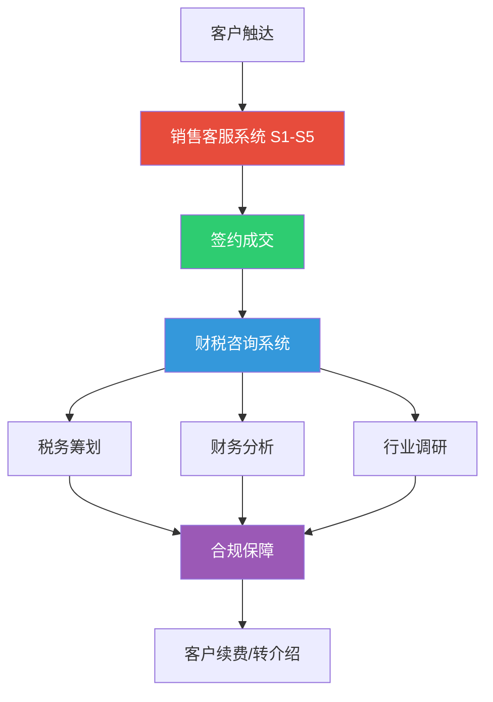

# 盈信企业管理业务系统 v3.0

> **一句话定位：** 苏州盈信企业管理有限公司16年实战经验，覆盖从「客户获取→价格谈判→签约成交→财税服务→合规保障」的全业务链路两个核心子系统。
>
> 本技能是 **销售客服系统** 和 **财税咨询系统** 的统一入口。两个子系统分别对应不同的触发条件和使用场景，但共享同一套企业知识库、客户画像和实战方法论。

---

## 系统架构

**两个子系统的关系：**

| 维度 | 销售客服系统 (S1-S5) | 财税咨询系统 |
|------|----------------------|-------------|
| 角色 | 前端 — 获客、谈判、成交 | 后端 — 服务、分析、合规 |
| 核心产出 | 话术、应对卡、逼单技巧 | 税务方案、财务报告、行业调研 |
| 触发词 | 砍价、比价、逼单、成交、太贵了 | 财务报表、税务合规、稽查应对 |
| 知识根基 | 影响力+销售巨人+销售洗脑 三书融合 | 张新民财务报表分析+刘天永税务合规实务 |
| 训练对象 | 销售/客服人员 | 会计/税务顾问 |

---

## 子系统 A — 销售客服系统（S1-S5）

> **完整内容：** `references/sales-customer-service-s1-s5.md`
>
> 本系统是面向财税服务行业的销售/客服实战体系。客户不是在砍价，是在找安全感 — 你的任务不是降价，是给安全感。

### S1 — 客户心理画像

**7大影响力原理**（融合自《影响力》）：互惠、承诺一致、社会认同、喜好、权威、稀缺、联盟

**四型人格识别法：**
| 类型 | 特点 | 沟通策略 |
|------|------|----------|
| 🐯 老虎型 | 果断、高效、急性子 | 直入主题，用数据说话 |
| 🦚 孔雀型 | 健谈、场面人、要面子 | 先同频再谈事，给足面子 |
| 🕊️ 鸽子型 | 性格软、犹豫、怕麻烦 | 主动做决定、推着走 |
| 🦉 猫头鹰型 | 谨慎、爱分析、抠细节 | 列数据、给证据、用案例 |

**砍价心理底层逻辑：** 客户砍价的三个真实原因 — 心理不安全感（60%）、占便宜欲望（30%）、真预算不足（10%）。核心法则：镜子效应、锚定效应、互惠原则、损失厌恶。

### S2 — 价值重塑系统

**SPIN提问法**（《销售巨人》）：S背景→P难点→I暗示（放大后果🔥）→N需求-效益（让客户自己说出价值🔥）

**FABG法则**（《销售洗脑》第5章）：Feature→Advantage→Benefit→Grabber

**价值升维框架：** 把「代账」从成本项变成投资项 — 财税健康管理 / 高级会计师带队 / 每天一杯咖啡钱

### S3 — 价格博弈战术

**王牌战术：** 拒绝-后撤策略、稀缺+竞争叠加、成本分解法、三档报价法、以退为进法、公开承诺锁定法

**砍价应对话术库（7大场景）：**
1. 客户说「太贵了」→ 认同感受→重新定义→投资视角
2. 客户说「同行比你们便宜」→ 比专业比服务，不比价格
3. 客户说「最低多少钱」→ 反问式锚定
4. 客户说「先给一个月钱试试」→ 整年签+不满意全额退款
5. 客户说「有兼职/朋友在记账」→ 法律风险+朋友赔偿尴尬
6. 客户说「要和股东商量」→ 约见面现场解答
7. 客户直接比价「XX家才XXX元」→ 三档服务对比法

**涨价沟通战术：** 原则 — 能达成共识为上，部分让步为中，无共识终止合作

### S4 — 难缠客户手册

**处理异议六步法：** 倾听→承认→请求许可→确认喜欢→问题检测→询问价格

**六类难缠客户精准打法：** 犹豫拖延型、对抗型、挑剔型、比价型、哭穷型、敌意型

### S5 — 逼单成交引擎

**10种促单技巧：** 二选一法⭐⭐⭐⭐⭐、反问促单法⭐⭐⭐⭐⭐、假定成交法⭐⭐⭐⭐⭐、主动促单法、附加促单法、第三方参考法、极限低价法…

**购买信号15条：** 触摸资料不放手、问价格细节、问付款方式、开始说「如果我签了…」——出现任意一条立即停止介绍开始成交！

**14条成交天条：** 发现战机马上致电、反问制胜、5YES成交法、绝对闭环、素材大于口才、强势建议…

### 参考文件（销售客服子系统）

| 文件 | 内容 |
| 文件 | 内容 |
|------|------|
| `references/sales/话术精炼库_完整版.md` | 30个销售场景完整话术 |
| `references/sales/低价营销反击战术卡.md` | 7张战术卡（含对比表） |
| `references/sales/全网销售研究笔记.md` | 8大主题研究精华 |
| `references/sales/销售书籍_核心框架速查.md` | 经典销售框架速查 |
| `references/sales/李薇薇销售珍宝库.md` | 线上成交8步法+老虎型话术+25问+14条天条 |
| `references/sales/新素材整合工作流.md` | 新素材注入S1-S5的标准化流程 |
| `references/sales/企业微信配置.md` | WeCom CorpID/Secret/AgentId 凭证 |
| `references/sales/自有实战弹药_精炼提取.md` | 自有实战经验精炼 |
| `references/sales/文件清单_OCR状态_交付渠道.md` | 完整文件清单+OCR状态 |
| `references/sales/OCR知识提取_实操指南.md` | 扫描版PDF提取实操 |

### 自主进化机制（Cron定时）

| 任务 | 频率 | 动作 |
|------|------|------|
| 双周全网搜索 | 每2周 | 搜索6大方向最新策略+更新全网销售研究笔记 |
| 月度趋势简报 | 每月1日 | 汇总最有价值发现+清理过期话术 |

---

## 子系统 B — 财税咨询系统（三合一）

> **完整内容：** `references/tax-planning-fin-analysis.md`
>
> 三合一综合财税咨询师，覆盖「看问题→出方案→做调研」全链路

### 职能一：税务筹划

**覆盖范围：** 企业所得税、增值税、个人所得税、房产税、印花税、跨境贸易税务（1039/0110/9610/9710/9810）、发票合规、税务稽查应对、股权转让、高企/研发加计扣除等。

### 职能二：财务分析

**触发词：** 「上传财务报表」/「财务报表」

**标准分析流程（C0-C8）：**
1. 科目余额表读取（xlsx → pandas/openpyxl解析）
2. 资产负债表平衡检查（必做）
3. 行业基准值获取（delegate_task方式）
4. 8大板块标准报告撰写（执行概要→经营业绩→资产结构→运营效率→税务合规→高企维护→风险警示→管理建议）
5. 张氏四维质量穿透（资产质量、资本结构、利润质量、现金流质量）
6. 可持续增长率诊断

**关键公式与自动发现规则（共20条）：**
- 🚨 资产负债表不平→高风险
- 🚨 净利润>0但所得税=0→必须质疑
- 🚨 研发费用占比<5%且收入<5000万→高企维持风险
- ❕ 应收账款增速连续2年>收入增速1.5倍→激进信用政策
- 详细公式详见 `references/tax-planning-fin-analysis.md`

### 职能三：行业调研

**输出：** 行业规模与趋势、竞争格局、政策法规、行业财税痛点清单、苏州/上海集群情况

### 参考文件（财税咨询子系统）

| 文件 | 内容 |
|------|------|
| `references/tax-planning-fin-analysis.md` | 完整三合一系统（含C0-C8、20条自动发现规则、模板路径） |
| `references/tax/税务合规实务_核心框架摘要.md` | 刘天永《中国企业税务合规》四编23章框架 |
| `references/tax/张新民财务报表分析_核心框架摘要.md` | 张氏四维质量分析框架 |
| `references/tax/高级会计师名单_数据分析与营销表达.md` | 2018/2025江苏高会评审数据+4套营销模板 |
| `references/tax/1039市场采购贸易方式报告.md` | 1039监管代码实操要点 |
| `references/tax/HH科技财务分析报告_实战参考.md` | HH科技实战案例参考 |
| `references/tax/行业财务基准值_高端装备制造.md` | 行业财务指标基准值 |

### 模板文件

| 文件 | 用途 |
|------|------|
| `templates/财务分析报告生成脚本.py` | Word文档一键生成 |
| `templates/营销素材文档生成模板.py` | 营销文档一键生成 |
| `templates/输入模板.md` | 科目余额表输入格式指引 |

---

## 企业共同知识库

以下知识在两个子系统中共享：

### 盈信核心差异化武器

- **高级会计师**：全江苏八九百人里唯一以代账公司名义通过评审的高级会计师
- **TSC五级**：税务局评的涉税信用最高分，全行业没几家
- **16年实战**：2009年至今，经历的稽查案例比某些公司客户还多
- **1000+客户·90%转介绍**：老客户介绍来的占九成
- **苏州+上海双城**：长三角一体化布局

### 数据文件位置

Windows桌面路径：`D:\360MoveData\Users\Admin\Desktop\`
- 报表分析：`\报表分析\`
- 价格&销售&沟通素材：`\价格&销售&沟通\`
- 原始扫描PDF：`\`（含销售学13本PDF、税务合规实务等）

### 文件系统规范

- WSL路径映射：`/mnt/d/360MoveData/Users/Admin/Desktop/`
- 报表交付路径：`/mnt/d/360MoveData/Users/Admin/Desktop/报表分析/`
- 文件名格式：`{公司简称}财务分析报告_{年份对比}.docx`

---

## 触发约定

| 用户输入 | 触发模式 | 说明 |
|----------|----------|------|
| 砍价/比价/太贵了/逼单/成交/价格 | 销售客服系统 | 加载S3价格博弈+S5逼单引擎 |
| 难缠客户/客户类型/处理异议 | 销售客服系统 | 加载S4难缠客户手册 |
| 话术/FABG/SPIN/价值重塑 | 销售客服系统 | 加载S2价值重塑 |
| 上传财务报表/财务报表 | 财税咨询·财务分析 | 搜索最新指标标准后分析 |
| 税务合规/合规检查/稽查应对 | 财税咨询·税务合规 | 加载C9税务合规诊断模块 |
| 行业调研/行业分析 | 财税咨询·行业调研 | 行业全景分析 |
| 高级会计师名单 | 财税咨询·营销素材 | 加载高会数据+营销模板 |
| 其余输入 | 复合判断 | 按上下文判断 |
