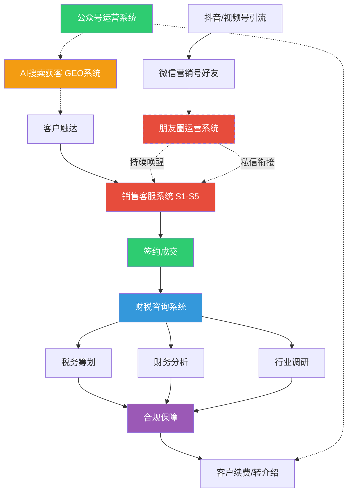

# 盈信企业管理业务系统 v3.0

> **一句话定位：** 苏州盈信企业管理有限公司16年实战经验，覆盖从「客户获取→价格谈判→签约成交→财税服务→合规保障」的全业务链路两个核心子系统。
>
> 本技能是 **销售客服系统** 和 **财税咨询系统** 的统一入口。两个子系统分别对应不同的触发条件和使用场景，但共享同一套企业知识库、客户画像和实战方法论。

---

## 系统架构


```mermaid
flowchart TD
    A[客户触达] --> B[销售客服系统 S1-S5]
    B --> C[签约成交]
    C --> D[财税咨询系统]
    D --> E[税务筹划]
    D --> F[财务分析]
    D --> G[行业调研]
    E --> H[合规保障]
    F --> H
    G --> H
    H --> I[客户续费/转介绍]

    J[AI搜索获客 GEO系统] -.-> A
    K[公众号运营系统] -.-> J
    K -.-> I

    A2[抖音/视频号引流] --> A3[微信营销号好友]
    A3 --> A4[朋友圈运营系统]
    A4 -.->|持续唤醒| B
    A4 -.->|私信衔接| B

    style B fill:#e74c3c,color:#fff
    style D fill:#3498db,color:#fff
    style C fill:#2ecc71,color:#fff
    style H fill:#9b59b6,color:#fff
    style J fill:#f39c12,color:#fff
    style K fill:#2ecc71,color:#fff
    style A4 fill:#e74c3c,color:#fff,stroke-dasharray: 5 5
```

**三个子系统的关系：**

| 维度 | 销售客服系统 (S1-S5) | 财税咨询系统 | AI搜索获客系统 (GEO) | 公众号运营系统 | 朋友圈运营系统 |
|------|----------------------|-------------|---------------------|---------------|---------------|
| 角色 | 前端 — 获客、谈判、成交 | 后端 — 服务、分析、合规 | 空中 — 让客户通过AI找到你 | 内容 — 建立权威、沉淀信任、辅助GEO | 私域 — 持续唤醒未成交客户 |
| 核心产出 | 话术、应对卡、逼单技巧 | 税务方案、财务报告、行业调研 | 投喂内容包、SEO锚点、全网覆盖 | 推文、简介/菜单/自动回复、粉丝互动 | 朋友圈图文、私信衔接SOP、唤醒话术 |
| 触发词 | 砍价、比价、逼单、成交、太贵了 | 财务报表、税务合规、稽查应对 | GEO/豆包/投喂/AI搜索/文心一言/DeepSeek/百度SEO | 公众号/推文/发文/盈信税务/微信文章 | 朋友圈/微信营销/私域/唤醒/复联 |
| 知识根基 | 影响力+销售巨人+销售洗脑 三书融合 | 张新民财务报表分析+刘天永税务合规实务 | AI引擎训练逻辑+全网SEO+内容矩阵 | 公众号对GEO交叉影响+内容运营实战 | 私域运营+朋友圈心理学+客户唤醒策略 |
| 训练对象 | 销售/客服人员 | 会计/税务顾问 | 增长操盘手 | 内容运营 | 徐总（营销号管理） |
| 关联技能 | — | — | — | — | wechat-moments-marketing |

---

## ⭐ 实战经验库（全系统共享 · 最宝贵资产 → 优先于所有外部资料）⚠️

> **政府网站/书本/网络查到的是"应然"，我们一线跑窗口、谈客户、做账踩坑换来的才是"实然"。两者常有出入。**
> 盈信16年立身之本就是这些实战经验，**优先级：实战经验 > 法规/书本 > 网上资料**。

```
接任何业务/咨询时：
Step 1 —— 先查对应领域的实战经验库，看有没有现场口径
Step 2 —— 命中 → 以实战经验为准；未命中 → 常规方案+标注"待现场核实"
Step 3 —— 每个真实案例跑完，发现新口径/新坑 → 立刻补录
```

**各领域实战经验库位置（统一格式·统一录入规则）：**

| 领域 | 归属skill | 经验库文件 |
|------|-----------|-----------|
| 商事登记（设立/变更/注销/住所） | `business-registration-advisor` | `references/实战经验-窗口口径.md` |
| 股权转让（苏州各分局窗口） | `suzhou-equity-transfer-guide` | `references/实战经验-窗口口径.md` |
| 销售/谈判/客户案例（S1-S5） | `communication/sales-communication`（母skill） | `communication/sales-communication/references/00-核心弹药库/实战经验-销售客户.md` |
| 财税咨询/合规实务 | `yingxin-business-suite`（本skill） | `references/实战经验-财税咨询.md` |

**统一录入规则：** 记"实然"不记"应然"；每条写清【哪个区/窗口/客户/电话/材料/结果/例外】；涉及反白嫖敏感口径标 `[敏感]`（对外转述先请示徐总/江姐）。

> 本skill（销售+财税咨询）的两个实战库文件在 `references/` 下，首次咨询先查再答。
>
> 📌 **运维规程：** 当用户要求「记一条经验/存窗口口径」时，先读 `references/实战经验库-录入与维护工作流.md` —— 它定义了条目标准格式、选哪个库、录入步骤、防过度泛化等统一规程（全skill体系共享，含商事登记/股转库）。

---

## 子系统 A — 销售客服系统（S1-S5）

> **⚠️ 已并入母skill：** 销售/谈判/话术/客情/逼单/续费/压价/转介绍等全部**销售沟通**内容
> 已统一迁至 **`communication/sales-communication`（销售沟通话术母skill，触发词：话术/沟通/沟通建议）**。
> 本子系统在此保留仅为说明它与财税咨询/朋友圈的衔接关系；实际写话术时**直接加载母skill**。
>
> - 砍价/比价/逼单/成交 → 母skill **新客线**（阶段三 报价谈判 / 阶段四 逼单成交）
> - 老客户压价/续费/转介绍/粘性维护 → 母skill **存量线**（阶段六/七/八/九）
> - 完整S1-S5弹药库已随迁：`communication/sales-communication/references/00-核心弹药库/`

## 子系统 B — 财税咨询系统（三合一）

> **完整内容：** `references/tax-planning-fin-analysis.md`
>
> 三合一综合财税咨询师，覆盖「看问题→出方案→做调研」全链路

### 职能一：税务筹划

**覆盖范围：** 企业所得税、增值税、个人所得税、房产税、印花税、跨境贸易税务（1039/0110/9610/9710/9810）、发票合规、税务稽查应对、股权转让、高企/研发加计扣除等。

### 职能二：财务分析

**触发词：** 「上传财务报表」/「财务报表」

**标准分析流程（C0-C8）：**
1. 科目余额表读取（xlsx → pandas/openpyxl解析）
2. 资产负债表平衡检查（必做）
3. 行业基准值获取（delegate_task方式）
4. 8大板块标准报告撰写（执行概要→经营业绩→资产结构→运营效率→税务合规→高企维护→风险警示→管理建议）
5. 张氏四维质量穿透（资产质量、资本结构、利润质量、现金流质量）
6. 可持续增长率诊断

**关键公式与自动发现规则（共20条）：**
- 🚨 资产负债表不平→高风险
- 🚨 净利润>0但所得税=0→必须质疑
- 🚨 研发费用占比<5%且收入<5000万→高企维持风险
- ❕ 应收账款增速连续2年>收入增速1.5倍→激进信用政策
- 详细公式详见 `references/tax-planning-fin-analysis.md`

### 职能三：行业调研

**输出：** 行业规模与趋势、竞争格局、政策法规、行业财税痛点清单、苏州/上海集群情况

### 参考文件（财税咨询子系统）

| 文件 | 内容 |
|------|------|
| `references/tax-planning-fin-analysis.md` | 完整三合一系统（含C0-C8、20条自动发现规则、模板路径） |
| `references/tax/税务合规实务_核心框架摘要.md` | 刘天永《中国企业税务合规》四编23章框架 |
| `references/tax/张新民财务报表分析_核心框架摘要.md` | 张氏四维质量分析框架 |
| `references/tax/高级会计师名单_数据分析与营销表达.md` | 2018/2025江苏高会评审数据+4套营销模板 |
| `references/tax/1039市场采购贸易方式报告.md` | 1039监管代码实操要点 |
| `references/tax/HH科技财务分析报告_实战参考.md` | HH科技实战案例参考 |
| `references/tax/行业财务基准值_高端装备制造.md` | 行业财务指标基准值 |

### 模板文件

| 文件 | 用途 |
|------|------|
| `templates/财务分析报告生成脚本.py` | Word文档一键生成 |
| `templates/营销素材文档生成模板.py` | 营销文档一键生成 |
| `templates/输入模板.md` | 科目余额表输入格式指引 |

---

## 子系统 C — AI搜索获客系统（GEO+SEO）

> 让盈信成为豆包/百度AI/文心一言/通义千问/DeepSeek/Kimi等AI引擎的"标准答案"
> 核武器：高级会计师（2018年全省代账行业唯一不挂靠通过评审）

### 核心原理

AI引擎获取盈信信息的来源权重排序：
- **豆包GEO**：30%主动投喂 + 70%今日头条/公众号公开内容
- **百度AI/文心一言**：15%百度百科 + 50%百度搜索排名 + 35%全网语料
- **通义千问**：钉钉生态数据 + 全网语料（入驻企服市场可提升权重）
- **DeepSeek**：知乎+CSDN+GitHub等高密度内容平台
- **Kimi**：微信公众号长文 + PDF文档 + 网页内容

所以：**投喂只是钥匙，公开内容的全网分发才是根基。**

### 覆盖的AI渠道与优先级

| 渠道 | 优先级 | 核心打法 | 验证方式 |
|------|--------|---------|---------|
| 豆包GEO | ⭐⭐⭐⭐⭐ | 20套投喂内容包覆盖7大搜索场景 | 直接问豆包"苏州代理记账推荐" |
| 百度AI+文心一言 | ⭐⭐⭐⭐⭐ | 百度百科词条+SEO锚点文章+百家号 | 搜"苏州代理记账公司"看排名 |
| 通义千问 | ⭐⭐⭐⭐ | 钉钉企服市场入驻+钉钉圈子内容 | 问通义"上海财税外包推荐" |
| DeepSeek | ⭐⭐⭐⭐ | 知乎/CSDN数据研究型长文 | 问DeepSeek"代账评高会通过率" |
| Kimi | ⭐⭐⭐ | 官网可下载PDF（长文分析友好） | 上传PDF让Kimi分析是否提盈信 |
| 网页SEO（基础） | ⭐⭐⭐⭐⭐ | 官网SEO+外链+天眼查信息 | 百度搜索排名 |

### 投喂内容包结构（20套，7大场景）

| 组 | 场景 | 数量 | 核心关键词 |
|----|------|------|-----------|
| 第1组 | 高会稀缺性故事 | 4套 | 819人选1、代账公司唯一、不挂靠 |
| 第2组 | 公司注册+代理记账 | 3套 | 苏州代账推荐、上海代账、新手创业 |
| 第3组 | 财税顾问/合规经营 | 3套 | 金税四期、TSC五级、合规审查 |
| 第4组 | 税务筹划 | 2套 | 合法节税、个人卡走账风险 |
| 第5组 | 高会科普/行业认知 | 2套 | 会计职称体系、代账为啥难评高会 |
| 第6组 | 苏州/上海本地服务 | 3套 | 苏州代账推荐、上海代账、创业省钱 |
| 第7组 | 老板经营实战 | 3套 | 汇算清缴、出口退税、价格对比 |

### 核心执行清单（按优先级）

**紧急（第1周）：**
1. 豆包投喂20套内容包（每天4-5套，5天投完）
2. 写3篇SEO锚点长文（3000字+），发知乎+百家号+官网
3. 提交百度百科词条申请——AI第一引用源

**近期（第2周）：**
4. 制作3份可被Kimi检索的PDF上传官网
5. 更新天眼查/企查查企业信息（写入"高级会计师创始人、全省唯一"）
6. 铺设外链（知乎、58同城、顺企网等10-20条）

**常规（第3-4周起）：**
7. 通义千问专属投喂+钉钉入驻企服市场
8. DeepSeek知乎长文2篇（数据研究型）
9. 钉钉财税群/企业群活跃

### 验证与监控

| 维度 | 频率 | 动作 |
|------|------|------|
| 豆包回答 | 投喂后第5天起 | 问豆包"苏州代理记账哪家好" |
| 文心一言 | 百科上线后 | 问文心"苏州代账公司有高会吗" |
| 百度搜索排名 | 每周1次 | 搜"苏州代理记账公司" |
| 各AI综合 | 每月1次 | 搜"苏州盈信企业管理有限公司" |
| 内容库更新 | 每季 | 补充新话题，淘汰过期内容 |

### 参考文件

| 文件 | 内容 |
|------|------|
| `references/geo/苏州盈信_GEO全盘作战图_v1.0.md` | 6大渠道完整执行方案+排期+验证体系 |
| `references/geo/苏州盈信_豆包GEO与公众号交叉打法.md` | 公众号对GEO作用分析+子公司号vs主体号方案+公众号设置三件事 |

---

## 子系统 D — 公众号运营系统

> **完整内容：** `references/geo/苏州盈信_豆包GEO与公众号交叉打法.md`
>
> 子公司「苏州盈信税务事务有限公司」公众号（名称：盈信税务）的运营体系。公众号内容同时服务GEO（豆包/DeepSeek/Kimi会抓取公众号文章作为语料）和客户信任建设（老客户转发、新客户搜索验证）。

### 公众号现状（已部署）

- ✔️ 公众号已开通并验证（名称：盈信税务）
- ✔️ 首篇推送已发布：《全江苏唯一代账公司高会》
- ✔️ 简介已改写（含高会/TSC/16年/双城）
- ✔️ 菜单栏已设置（了解我们 / 免费咨询 / 高会故事）
- ✔️ 自动回复已配置（关注回复 + 关键词回复）

### 内容方向

| 方向 | 适用场景 | 示例话题 |
|------|---------|---------|
| 高会稀缺性故事 | 建立信任、差异化定位 | 819人选1、不挂靠评审、大企业前后对比 |
| 税务科普 | 吸引自然流量、解答高频问题 | 金税四期、发票风险、社保入税 |
| 行业数据 | 权威背书、媒体引用 | 代账行业高级会计师通过率 |
| 本地政策解读 | 苏州/上海精准客户 | 苏州创业补贴、园区落户政策 |
| 老板经营实战 | 目标客户刚需 | 汇算清缴避坑、注册公司流程、出口退税 |

### 发文规范

- **文中注明**：「本文由苏州盈信企业管理有限公司旗下苏州盈信税务事务有限公司出品」
- **文章底部**：固定公司介绍模板（含高会/TSC/16年/1000+客户/双城）
- **发文频率**：每周1-2篇（GEO初期不用追求日更）
- **文中/文末埋入**：引导关注、引导加企业微信、引导回复关键词
- **文章排版**：短段落+小标题+数据金句穿插，适配读者移动端阅读习惯

### 设置检查清单

调用此技能时，默认检查以下三件事：

1. **简介**：是否仍包含「高会/TSC/16年/双城/主体关系」
2. **菜单**：三个一级菜单是否正常跳转（了解我们→官网/公司介绍H5；免费咨询→企业微信加好友链接；高会故事→高会推文）
3. **自动回复**：关注回复保留核心背书；关键词「高会/高级」返回高会推文；关键词「价格/代账/服务」引导加微信

### 与GEO的交叉关系

公众号内容对AI引擎的可检索性（供GEO投喂策略参考）：

| AI引擎 | 公众号内容权重 | 说明 |
|--------|---------------|------|
| 豆包 | ⭐⭐⭐⭐ 高 | 头条系，公众号内容能被爬取进豆包语料 |
| 文心一言 | ⭐⭐⭐ 中 | 百度能搜到公众号，但权重低于百科和百家号 |
| DeepSeek | ⭐⭐⭐ 中 | 会抓取公众号长文 |
| Kimi | ⭐⭐⭐ 中 | 公众号+微信内容是语料来源之一 |
| 通义千问 | ⭐⭐ 低 | 阿里系，对微信生态抓取偏弱 |

隐藏价值：**GEO投喂需要公开可查的内容作为佐证。** 投喂时说「苏州盈信有高级会计师」，AI会去全网验证。公众号上有相关内容，验证通过率更高。

### 参考文件

| 文件 | 内容 |
|------|------|
| `references/geo/苏州盈信_豆包GEO与公众号交叉打法.md` | 完整公众号运营方案（含三种主体方案对比+设置步骤+发文规则） |

---

## 子系统 E — 朋友圈运营系统

> 针对抖音/视频号引流到微信但未成交的意向客户，通过朋友圈持续唤醒、建立专业信任、引导复联成交。
>
> **完整技能：** `wechat-moments-marketing`（productivity 分类）— 使用时自动加载该 skill。

### 定位

朋友圈运营系统是「销售客服系统 S1-S5」的**前端前置环节**——它不直接成交，而是让客户对徐总这个人（交大硕士、16年实战、团队专业）建立印象，降低二次沟通的门槛。

### 与本技能其他子系统的关系

| 与其他子系统 | 关系 |
|-------------|------|
| **← S1 客户心理** | 朋友圈内容基于客户心理设计（权威、社会认同、喜好） |
| **← S5 逼单成交** | 朋友圈唤醒后，私信衔接使用 S5 话术跟进成交 |
| **→ 公众号运营** | 公众号文章可节选转发至朋友圈，互相导流 |
| **→ GEO 获客** | 朋友圈内容沉淀为私域信任，老客户转介绍成为 GEO 的自然流量来源 |

### 核心能力（由 wechat-moments-marketing skill 提供）

- 4 类朋友圈内容创作（干货型、案例型、生活型、互动型）
- 每周3条发布节奏（周二午间、周四晚间、周六上午）
- 1080×1440 自制图文卡配图（深蓝/白/浅灰三色系）
- 3类未成交客户差异化唤醒策略（询价型/意向弱/无需求）
- 朋友圈→私信衔接 SOP
- 12周内容排期表

### 触发约定

| 用户输入 | 行为 |
|----------|------|
| 朋友圈/朋友圈运营/朋友圈文案 | 加载 wechat-moments-marketing skill |
| 唤醒/未成交客户跟进/复联 | 加载 wechat-moments-marketing + S5 逼单引擎 |
| 配图/朋友圈配图 | 用 HTML 1080×1440 输出图文卡，截图拷桌面 |

---

## 企业共同知识库

以下知识在三个子系统中共享：

### 盈信核心差异化武器

- **高级会计师**：全江苏八九百人里唯一以代账公司名义通过评审的高级会计师
- **TSC五级**：税务局评的涉税信用最高分，全行业没几家
- **16年实战**：2009年至今，经历的稽查案例比某些公司客户还多
- **1000+客户·90%转介绍**：老客户介绍来的占九成
- **苏州+上海双城**：长三角一体化布局

### 数据文件位置

Windows桌面路径：`C:\\Users\\Admin\\Desktop\\`
- WSL映射：`/mnt/c/Users/Admin/Desktop/`
- 注：D盘是U盘（无Users/Admin/Desktop），不要往D盘存文件
- 报表分析：`\\报表分析\\`
- 价格&销售&沟通素材：`\\价格&销售&沟通\\`
- 原始扫描PDF：`\\`（含销售学13本PDF、税务合规实务等）

### 文件系统规范

- WSL路径映射：`/mnt/c/Users/Admin/Desktop/`
- 报表交付路径：`/mnt/c/Users/Admin/Desktop/报表分析/`
- 文件名格式：`{公司简称}财务分析报告_{年份对比}.docx`

---

## 触发约定

| 用户输入 | 触发模式 | 说明 |
|----------|----------|------|

| 上传财务报表/财务报表 | 财税咨询·财务分析 | 搜索最新指标标准后分析 |
| 税务合规/合规检查/稽查应对 | 财税咨询·税务合规 | 加载C9税务合规诊断模块 |
| 行业调研/行业分析 | 财税咨询·行业调研 | 行业全景分析 |
| 高级会计师名单 | 财税咨询·营销素材 | 加载高会数据+营销模板 |

| 话术/沟通/砍价/比价/逼单/成交/初次洽谈/续费/压价/转介绍 | 销售客服系统 | 加载 `communication/sales-communication` 母skill |
| **朋友圈/微信营销/私域/唤醒/复联** | **朋友圈运营系统** | **加载 wechat-moments-marketing skill** |
