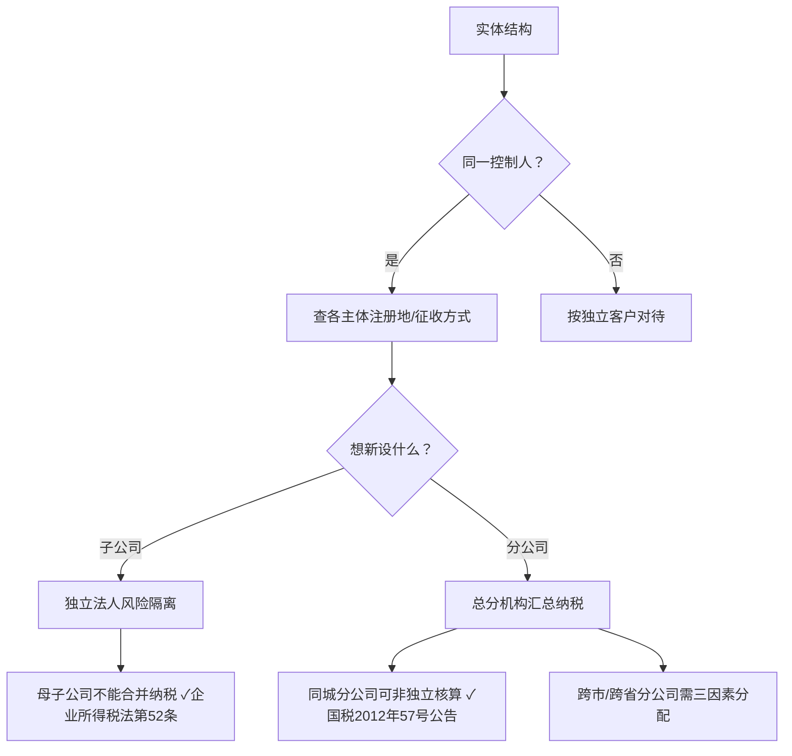

# 企业架构重组·税务筹划·合规方案 方法论

## 概览

本技能覆盖企业架构重组与税务筹划的标准工作流。基于苏州盈信财税（**TSC五级涉税专业服务机构**，438.11分，全省前列；苏州市财政局备案）创始人江敏（高级会计师，25年财税经验，会计/审计科班出身，以代理记账公司名义独立通过高级会计师评审）的实战方法提炼。

**核心原则：** 不要做假设。任何结构、数据、征收方式，必须与客户老板逐一核实后方可写入方案。

---

## 第一阶段：信息收集协议（2026.5.14 江姐指导）

信息收集是**最关键的阶段**。本会话中两次重大信息更正（卡曼→咖萌、2个分公司→2个个体户）表明：初始信息几乎必然不完整。

### 信息收集清单（必须逐项确认）

```
┌────────────────────────────────────────────────────────────────┐
│  □ 实体架构：有哪些法人实体？有限公司/个体户/分公司/子公司？    │
│  □ 注册地：各实体注册在哪个城市？分别一般纳税人/小规模？        │
│  □ 征收方式：核定还是查账？核定基数多少？实际营收多少？          │
│  □ 控制关系：哪些是同一实控人？哪些是独立老板？                 │
│  □ POS资金流向：进公账还是私户？差额有没有申报？               │
│  □ 社保状态：各实体员工缴纳社保了吗？缴纳地是哪里？            │
│  □ 商业模式：采购→销售链路？一级/二级/三级经销商？             │
│  □ 用工形式：自有员工还是劳务派遣？发票开给谁？                │
│  □ 房租归属：谁租的商铺？发票开给谁？                           │
│  □ 已享优惠政策：小微企业？高新？加计扣除？                     │
└────────────────────────────────────────────────────────────────┘
```

### ⚠️ 信息收集陷阱（REV2教训总结）

1. **"分公司"≠"个体户"** — 客户可能统称为"苏州那两个店"，你问"是分公司吗？"客户可能随口答"对"。必须追问营业执照类型。
2. **经营范围≠实体结构** — 客户说"我们在苏州有业务"不意味着就是分公司/个体户。必须问："苏州那个店是你另一家公司开的，还是用你南通公司注册的分支机构？"
3. **同一实控人不等于同一主体** — 赵老板名下有两家公司（咖萌和爽煌）。客户可能只说"我的店"，不主动提及多家主体。
4. **核定征收的差额容易被忽略** — 客户说"核定两万八"，但不主动说"实际收了五六万"。必须单独追问"跟核定数比，实际收款大概多少？差额有没有申报？"
5. **POS资金归属必须专门确认** — 不能默认POS机走公账。必须问"POS机的款是进公司账户还是您个人账户？"
6. **社保缴纳状态必须单独确认** — 不能默认"有给员工交社保"。必须问"员工社保是在苏州交的吗？社保状态正常吗？"

### 信息确认流程

```
① 客户陈述（自然语言，通常不完整）
② 助手整理为结构化清单
③ 发送给客户确认（逐项列出，让客户逐项回答）
④ 如信息有矛盾或漏洞 → 再次追问
⑤ 全部确认后 → 写案例文件 → 开始分析
```

**不允许跳过步骤③直入方案设计。** 信息不全就出方案，等于白出。

---

## 第二阶段：实体结构分析框架

### 核心问题树



### 方案选项对比框架

对于"在B地开设新门店"，标准选项：

| 选项 | 法人属性 | 所得税 | 增值税 | 风险隔离 | 管理成本 |
|------|---------|--------|--------|---------|---------|
| 分公司（同城） | 非独立 | 汇总到总公司 | 可汇总 | 弱 | 低 |
| 分公司（跨市/省） | 非独立 | 三因素分配预缴 | 属地申报 | 弱 | 中 |
| 子公司 | 独立法人 | 独立申报 | 独立申报 | 强 | 高 |
| 个体户 | 独立 | 经营所得个税 | 独立申报 | 弱 | 低 |

### ⚠️ 常见误解纠正

| 误解 | 纠正 | 依据 |
|------|------|------|
| 母子公司可以合并纳税 | ❌ 独立法人各自申报 | 企业所得税法第52条 |
| 分公司就是总公司的延伸 | ✅ 但不等于可跨市汇总 | 国税2012年57号公告 |
| 子公司亏损可以抵母公司利润 | ❌ 独立纳税，不能互抵 | 企业所得税法第52条 |
| 同城分公司必须独立核算 | ❌ 可申请非独立核算 | 省级税务机关规定 |
- 个体户注销不用管差额 | ❌ 注销查账可能触发补税 | 税收征管法 |
| 股东干活可以不发工资 | ❌ 实质重于形式，事实劳动关系可能被认定 | 劳动合同法+社保法 |
| 股东不交社保可以发工资 | ❌ 发工资即建立劳动关系，强制参保 | 社会保险法第58条 |

---

## 第三阶段：方案验证方法论

### 验证三步法

```
第一步：逐条分析 → 对方案中每个主张，问"有法条支撑吗？"
   ✅ 有法条 → 说明正确，附上文件号
   ❌ 无法条 → 质疑其准确性

第二步：区分层级 → 实体结构有几个层级？各层级适用什么规则？
   ✅ 分清总分机构关系 vs 母子关系
   ✅ 分清同城 vs 跨市 vs 跨省

第三步：识别风险补丁 → 方案落地的"暗礁"有哪些？
   ✅ 旧实体注销前要干什么
   ✅ 成本发票抬头要平移
   ✅ 用工合同要重新签
```

### ⚠️ "方案听起来不错"陷阱

很多方案"听起来对"但经不起推敲。标准实战模式：

```
客户说："我苏州那两个店想转成南通公司的分公司"
→ 查证：那两个店目前是什么主体？（个体户/另一家公司？）
→ 路径：注销旧主体→南通公司设立分公司→平移人员/合同/资产
→ 发现：旧主体可能有未申报收入 → 注销前必须补税
→ 产出：方案 + 3个补丁
```

---

## 第四阶段：风险评估模板

### 风险分级

```
🔴 紧急（本周处理）：私账收款未申报、社保零参保
🟡 重要（本月处理）：个体户注销前补税、合同主体平移
🟢 常规（季度内）：内部结算机制建立、发票抬头统一
```

### 风险评估结构

每个风险点应输出：

```
┌────────────────────────────────────────────────────────────────┐
│  风险点：[具体事项]                                             │
│  风险定性：[偷漏税/合规/管理]                                    │
│  触发机制：[什么条件下会被发现]                                  │
│  后果量化：[补税×万 + 滞纳金×% + 罚款×~×倍]                    │
│  整改路径：[步骤1→步骤2→步骤3]                                  │
│  整改时效：[本周/本月/季度内]                                    │
└────────────────────────────────────────────────────────────────┘
```

---

## 第五阶段：方案交付模板

### 报告结构

```
一、公司架构全景
二、关键事实清单
三、方案架构说明
四、方案验证分析（逐条：正确/需纠正/需补丁）
五、方案选项对比（推荐方案 + 备选方案，含对比表）
六、风险评估（每个风险点单独卡片）
七、成本归属与内部结算（如涉及多主体）
八、关键法规索引
```

### 交付物格式

- 桌面 .docx（默认），160~220段，4~5张表
- 终端 ASCII 摘要（配合 workbuddy-output 技能）
- **不出 Markdown**（江姐明确拒绝）

---

## 参考案例

本技能参考案例及其完整会话记录见 `references/` 目录。

| 案例 | 文件名 | 关键教训 |
|------|--------|---------|
| 南通咖萌 | `references/nt-sports-case.md` | 信息收集失败→REV2改正；母子公司不能合并纳税；个体户注销补税 |

---

## 从本会-话提取的方法论规则（2026.5.14）

### 规则1：先做信息核实，再做方案设计（不可跨越阶段）
每轮信息确认后，所有信息必须写入案例文件。文件版本号标注（REV1/REV2等）。

### 规则2：方案设计必须包含验证环节
对方案中每个主张，逐条问"有法条支撑吗？" — ⚠️ 法律类回复必须附加具体判例（中国裁判文书网来源）方可采用。

### 规则3：任何"好注意"至少附带3个补丁
即：方案本体 + 三个执行障碍的解决方案。

### 规则4：表格必须用 workbuddy-output 技能的 box_maker.py 生成
禁止手写ASCII表格、禁止Markdown表格。（硬规则，无例外）

### 规则5：税务筹划方案每项必须附带风险提示，不得只讲好处
法规引用必须列明文件号（如：财税〔2023〕XX号）。

### 规则6：所有方案末尾加
「⚡ 以上方案基于您提供的信息生成，实际执行前建议进一步确认」

### 规则7：客户沟通话术
方案交付后，同步给出与客户电话/微信沟通的话术草稿，让江姐可以直接用。
